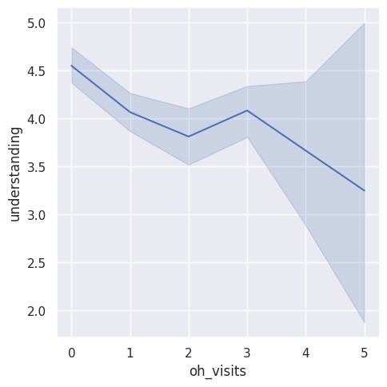
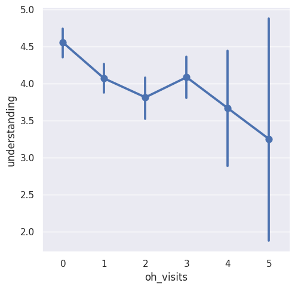
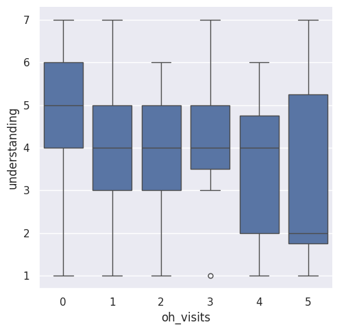

---
# Do not edit the text between these lines!
layout: default
---

# Analysis of Office Hour Impact on Student Understanding

## Project Overview
This project examines how **Office Hour (OH) attendance** influences student **understanding**. Using Python and the Seaborn library, we transformed raw survey data into statistical visualizations to identify learning trends.

## Data Processing
To prepare the data for visualization, we followed these steps:
* **Loading:** Read raw data from `survey_izzi.csv`.
* **Transformation:** Converted categories into numerical values to allow for mathematical plotting.
* **Cleaning:** Used custom utilities to filter the dataset for relevant office hour visits.

## Visualizing the Results
We generated three distinct types of plots to analyze the data:

1. **Line Plots:** To track the direct correlation between visit counts and comprehension.

2. **Point Plots:** To show the average understanding scores and the degree of uncertainty.

3. **Box Plots:** To visualize the full distribution of scores, including the median and quartiles.
